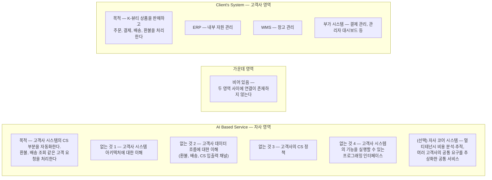

# 층 0 — 두 영역의 목적과 결핍

작성일: 2026-08-23
시간 상한: 20분 (작도 기준, 준수)

---

## 1. 질문

> 어느 K-뷰티 브랜드의 고객센터에 코어 AI 엔진을 붙여서, 지금 사람이 하고 있는 CS 대응을 자동으로 처리하게 만들려고 한다. 상자 두 개뿐이고 둘 사이에 아무것도 없는 현재 상태에서, **무엇이 성립하지 않는가.**

## 2. 그림

원본: `docs/user-sketches/layer-0.excalidraw` (이미지: `layer-0.png`)

작업자가 작도에서 내린 결정 두 가지.

1. **상자 대신 영역으로 구분한다.** 점선 두 개로 캔버스를 세 영역으로 나눴다. 층이 내려가면서 각 영역 안에 구성 요소가 쌓일 것이므로, 닫힌 상자보다 열린 영역이 확장에 맞다.
2. **결핍을 묻기 전에 목적을 먼저 정의한다.** 결핍은 목적에 대해서만 정의된다. "무엇이 없는가"를 판정할 기준이 필요하므로, 각 영역에 `<What It Does>`를 먼저 적었다.

확정된 그림을 Mermaid로 옮기면 다음과 같다. 왕복 절차에서 정정된 내용(4절)이 반영되어 있다.

**화살표가 하나도 없는 것은 원본 그대로다.** 연결이 존재하지 않는다는 사실 자체가 이 층의 답이기 때문이다.

## 3. 성립하지 않는 것 — 도출 결과

자사 영역의 `<What It Needs Right Now>`가 결핍 목록이다. 각각이 층 1 이후에서 구성 요소가 될 재료다.

| # | 결핍 | 내용 |
|---|---|---|
| 1 | 고객사 시스템 아키텍처에 대한 이해 | 엔진은 고객사 시스템이 무엇으로 구성되고 어떻게 동작하는지 모른다 |
| 2 | 고객사 데이터 흐름에 대한 이해 | 엔진은 환불, 배송, CS 입출력 채널이 고객사 안에서 어떻게 처리되는지 모른다 |
| 3 | 고객사의 CS 정책 | 엔진은 고객사 정책을 따르는 방식으로 행동해야 하는데, 그 정책을 갖고 있지 않다 |
| 4 | 프로그래밍 인터페이스 | 엔진이 무엇을 해야 할지 알아내더라도, 고객사 시스템의 해당 기능을 법적으로·프로그램적으로 적절하게 실행할 수단이 없다 |

결핍 1~3은 **이해의 문제**이고 결핍 4는 **실행 수단의 문제**다. 성격이 다르므로 채워지는 시점도 다르다. 1~2는 전환 1(고객사 시스템 파악)에서, 3은 온보딩 2단계(매뉴얼 정리)에서, 4는 층 1~3(연동 설계와 어댑터 구현)에서 채워진다.

### 선택 항목 — 자사 코어 시스템

다섯 번째 항목은 이번 고객사에 대한 결핍이 아니라 **자사 관점의 사업 구조에 대한 관찰**이다.

- 코어 시스템은 고객사별 비용 분석과 추적을 멀티테넌시로 제공한다.
- 여러 고객사에서 반복되는 공통 요구를 정리한 "공통 서비스"를 제공한다. 이것은 CS 데이터 흐름의 프로그래밍 가능한 추상화이며, LLM API 호출, 도구 정의와 적시 호출, 온톨로지 구조의 정책 참조를 포함한다.
- 고객사별 이해를 room, 고객사를 tenant로 표현할 수 있다.
- 연동 사례가 쌓일수록 공통 추상화가 정교해지고, 그것이 자사의 경쟁력이 된다.

이 항목은 층 2(코어 엔진 내부 분해)에서 "고객사마다 달라지는 부분과 공통인 부분의 경계"를 정할 때 다시 등장한다.

## 4. 왕복 절차에서 발견되고 정정된 것

| 발견 | 처리 |
|---|---|
| 고객사 영역의 `<What It Does>`가 자사 영역과 글자 그대로 동일한 텍스트였다 | 복사 후 수정 누락으로 확인. 고객사 시스템의 목적은 "K-뷰티 상품을 판매하고 주문·결제·배송·환불을 처리한다"로 이 문서에서 바로잡았다. 원본 스케치는 사고 과정 보존 원칙에 따라 고치지 않는다 |
| 텍스트와 영역의 소속 관계가 JSON에 없어 좌표로 추론해야 했다 | 다음 그림부터 텍스트를 영역 이름표와 그룹으로 묶는다 |
| `.excalidraw` JSON 판독 검증 (미해결 사항) | **통과.** 텍스트가 `originalText` 필드에 온전히 들어 있어 오독 여지가 없다. 캡처 방식으로 되돌릴 필요 없음 |

## 5. 계획(00-approach.md)과 실제의 비교

시뮬레이션은 층 0에서 "채널(문의 유입)"과 "연동부"가 도출될 것으로 예상했다.

- **연동부** — 가운데 빈 영역으로 도출되었다. 계획과 일치한다.
- **채널** — 독립 구성 요소로 도출되지 않았다. 결핍 2의 "CS 입출력 채널" 안에 암묵적으로만 존재한다. **소비자도 아직 도식에 없다.** 문의가 엔진에 도달하는 경로가 없으므로, 계획대로 소비자와 채널은 층 1에서 도출의 결과로 나와야 한다.

## 6. 층 1로 넘기는 것

1. **가운데 영역을 채우는 연동 설계.** 결핍 4가 직접 재료다. 고객사 시스템의 실제 모습은 아직 모르므로, 가짜 인터페이스로 먼저 만들고 나중에 실제에 맞춰 고친다(00-approach.md의 방법 B).
2. **문의 유입 경로의 명시적 도출.** 소비자와 채널이 어디에 어떻게 붙는지가 이번 층에서 나오지 않았다.
3. **가상 고객사 설정 확정.** 브랜드명, 상품군, 판매 채널 구성. 층 1의 그림에 고객사 영역의 구성 요소가 구체화되려면 필요하다.
