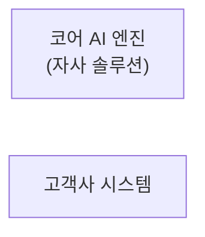

# 진행 상태

**세션을 시작하면 `CLAUDE.md`를 읽은 뒤 이 파일을 읽는다.**
층이나 전환이 끝날 때마다 이 파일을 갱신하고 커밋한다.

---

## 현재 위치

**층 0 시작 직전.** 준비 단계가 모두 끝났다. 설계는 아직 시작하지 않았다.

## 완료한 것

| 시점 | 내용 |
|---|---|
| 2026-08-20 | 진행 방식 설계 및 목표 달성 검증 (`docs/00-approach.md`) |
| 2026-08-20 | 저장소 생성, `README.md`, `.gitignore`, `.env.example` |
| 2026-08-20 | `CLAUDE.md` 작성 — 목적, 설명 규칙, 진행 방식, 역할 분담, 그림 주고받기 절차, 세션 운영 |
| 2026-08-20 | 스케치 보관 규칙 (`docs/sketches/`) |

## 다음에 할 일 — 층 0

현재 그림은 상자 두 개뿐이고 둘 사이에 아무것도 없다.

**질문**

> 어느 K-뷰티 브랜드의 고객센터에 이 엔진을 붙여서, 지금 사람이 하고 있는 CS 대응을 자동으로 처리하게 만들려고 한다. 무엇이 필요한가?

**막힐 때 접근할 방향** — 각각이 서로 다른 것을 드러낸다.

1. **구체적인 문의 하나를 끝까지 따라간다.** 예: "3일 전에 주문했는데 아직 배송 시작도 안 됐어요. 언제 오나요?" 이 문장이 뜬 순간부터 고객이 답을 받고 만족하는 순간까지, 무슨 일이 순서대로 일어나야 하는가.
2. **각 단계마다 "지금은 누가 이걸 하고 있는가"를 묻는다.** 사람이 무엇을 보고 무엇을 눌러서 답을 만드는지 생각하면, 엔진이 대신하려면 무엇에 접근해야 하는지가 드러난다.
3. **두 상자에 각각 "이건 없다"를 적는다.** 엔진에게 없는 것은 무엇이고 고객사 시스템에게 없는 것은 무엇인가.

**의도적으로 소비자를 상자로 그리지 않았다.** 처음부터 그려 두면 존재가 전제된다. 두 개에서 출발해야 소비자와 채널이 도출의 결과로 나온다.

**시간 상한: 20분.** 완벽하게 채울 필요 없다. 빠진 것은 다음 층에서 드러난다.

**산출물**: `docs/01-layer0.md`, `docs/sketches/layer0.excalidraw`, `docs/sketches/layer0.png`

## 미해결 사항

| 항목 | 내용 | 필요 시점 |
|---|---|---|
| Anthropic API 키 | 아직 발급받지 않았다. `console.anthropic.com`에서 발급 후 `.env`에 넣는다 | 층 2 코어 루프 구현 전 |
| 가상 고객사 설정 | 브랜드명, 취급 상품군, 판매 채널 구성을 아직 정하지 않았다 | 층 0 또는 층 1 |
| `.excalidraw` 파싱 검증 | JSON 구조가 기대만큼 명료하게 읽히는지 **첫 파일에서 실제로 확인해야 한다.** 읽기 불편하면 캡처 방식으로 되돌린다 | 층 0 첫 그림 |

## 발견한 문제

목표 3의 산출물은 `docs/problems.md`에 누적한다. 아직 비어 있다.

## 환경 메모

- 저장소: https://github.com/leonroars/kbeauty-cs-agent (공개)
- git 이메일은 이 저장소에만 GitHub noreply 주소로 설정되어 있다. 전역 설정은 건드리지 않았다.
- `gh` CLI 설치 및 인증 완료 (`leonroars`)
- 작도 도구: excalidraw.com (무료, 로그인 불필요)
